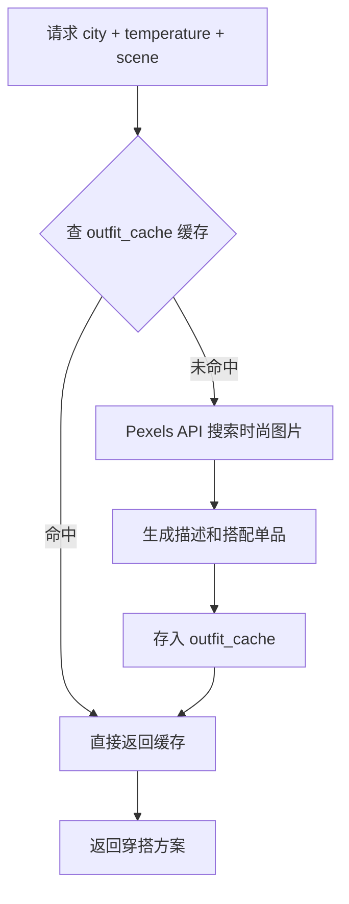
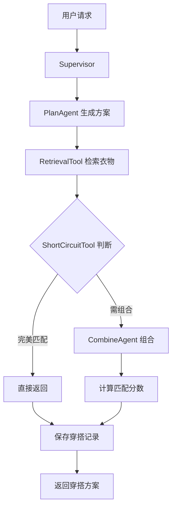

# CLAUDE.md

This file provides guidance to Claude Code (claude.ai/code) when working with code in this repository.

## 项目概述

Corgi Style 是一个 AI 穿搭推荐系统，采用前后端分离架构。前端使用 Next.js + React + TailwindCSS，后端使用 FastAPI + PostgreSQL + LangChain，核心是基于 LangGraph 的多 Agent 协同系统实现智能穿搭推荐。

## 开发命令

### 前端 (app/)
```bash
cd app
npm install          # 安装依赖
npm run dev         # 开发服务器 (Next.js + Turbopack)
npm run build       # 生产构建
npm run start       # 启动生产服务器
npm run lint        # 代码检查
```

### 后端 (service/)
```bash
cd service
pip install -r requirements.txt    # 安装 Python 依赖
cp .env.example .env             # 复制环境变量配置
psql -U postgres -f schema.sql    # 初始化数据库
uvicorn app.main:app --reload    # 启动开发服务器 (端口 8000)
```

### 数据库操作
```bash
psql -U postgres -d outfit_agent  # 连接数据库
# 或使用 cleanup_deleted_clothes() 函数清理已删除衣物
```

## 架构概览

### 后端架构 (service/)

```
service/
├── app/
│   ├── main.py              # FastAPI 应用入口
│   ├── database.py          # 数据库连接和会话管理
│   ├── models/             # SQLAlchemy ORM 模型
│   ├── routers/            # FastAPI 路由 (user, clothes, outfit)
│   ├── services/           # 业务服务层
│   └── agent/             # AI Agent 层 (核心)
└── schema.sql             # 数据库初始化脚本
```

#### 核心 AI Agent 系统

基于 LangGraph 的多 Agent 协同系统，负责穿搭推荐逻辑：

- **Supervisor** (`agent/supervisor.py`) - 主控 Agent，协调整个推荐流程
  - 调用 PlanAgent 生成穿搭方案
  - 使用 RetrievalTool 检索衣物
  - 使用 ShortCircuitTool 进行快速匹配判断
  - 调用 CombineAgent 组合最终穿搭
  - 保存穿搭记录到数据库

- **PlanAgent** (`agent/plan_agent.py`) - 规划 Agent，根据用户画像、天气、场景生成穿搭方案

- **ClothesAgent** (`agent/clothes_agent.py`) - 衣物匹配 Agent，负责衣物检索和匹配

- **CombineAgent** (`agent/combine_agent.py`) - 组合 Agent，当没有完美匹配时智能组合衣物

- **Tools** (`agent/tools.py`) - Agent 工具集，包括衣物检索工具

#### 后端服务层 (services/)

- **image_analysis.py** - 图片分析服务（使用 AI 提取衣物特征）
- **image_generator.py** - 图片生成服务（衣物卡通化）
- **image_searcher.py** - 图片搜索服务（Pexels API，搜索网络时尚穿搭图片）
- **llm_providers.py** - LLM 提供商配置（通义千问/OpenAI）
- **oss_uploader.py** - 阿里云 OSS 文件上传服务

#### 数据库设计要点

- 使用 PostgreSQL + SQLAlchemy 2.0
- **行级安全 (RLS)**：所有核心表 (user_profiles, clothing_items, outfit_histories) 启用 RLS，确保用户只能访问自己的数据
- **软删除**：clothing_items 表使用 `is_deleted` 字段，3 天后通过 `cleanup_deleted_clothes()` 函数物理删除
- **JSONB 字段**：style_preferences, season_preference, tags 等使用 JSONB 存储灵活数据
- **辅助函数**：
  - `set_user_id(user_uuid)` - 设置当前用户上下文
  - `current_user_id()` - 获取当前用户 ID（用于 RLS）
  - `get_wardrobe_stats(user_uuid)` - 获取衣物统计
  - `get_underused_clothes(user_uuid)` - 获取未被充分利用的衣物

### 前端架构 (app/)

```
app/
├── src/
│   ├── app/               # Next.js App Router 页面
│   │   ├── page.tsx      # 首页
│   │   ├── wardrobe/     # 衣橱页面
│   │   └── profile/     # 个人中心页面
│   ├── components/       # 可复用组件
│   ├── hooks/          # React Hooks (useWeather)
│   ├── lib/            # 工具函数
│   ├── styles/         # 样式文件
│   └── types/         # TypeScript 类型定义
```

#### 技术栈
- Next.js 15 (App Router) + React 18 + TypeScript
- TailwindCSS 4
- Radix UI 组件库
- Motion (Framer Motion) 动画
- Lucide React 图标

### API 路由结构

- `POST /user/get-or-create` - 获取或创建用户（基于设备指纹）
- `POST /user/update-info` - 更新用户信息
- `GET /user/preference` - 获取用户偏好

- `POST /clothes/add` - 添加衣物（含图片分析和卡通化）
- `GET /clothes/list` - 获取衣物列表
- `POST /clothes/delete` - 删除衣物（软删除）

- `POST /outfit/generate-today` - 生成今日穿搭（**网络图片搜索模式**，不依赖用户衣柜）
- `POST /outfit/refresh` - 刷新今日穿搭（清除缓存重新生成）
- `POST /outfit/feedback` - 提交穿搭反馈
- `GET /outfit/cache-status` - 查询缓存状态

- `GET /history/list` - 获取穿搭历史列表
- `GET /history/{id}` - 获取穿搭历史详情
- `POST /history/save` - 保存穿搭快照
- `GET /history/stats/summary` - 获取穿搭统计摘要

API 文档: http://localhost:8000/docs (FastAPI 自动生成)

### 穿搭推荐流程（两个模式）

**模式一：今日主打推荐**（已上线）


**模式二：AI 深度定制推荐**（待开发）
- 调用 LangGraph Agent 系统
- 基于用户衣柜衣物 + 天气 + 场景
- 使用 `POST /history/save` 接口触发 Supervisor



## 环境变量

后端需要配置 `.env` 文件：

| 变量名 | 说明 | 默认值 |
|--------|------|--------|
| DB_HOST | 数据库主机 | localhost |
| DB_PORT | 数据库端口 | 5432 |
| DB_USER | 数据库用户名 | postgres |
| DB_PASSWORD | 数据库密码 | password |
| DB_NAME | 数据库名 | outfit_agent |
| OPENAI_API_KEY | 通义千问 API 密钥 | - |
| OPENAI_BASE_URL | API Base URL | https://dashscope.aliyuncs.com/compatible-mode/v1 |
| PEXELS_API_KEY | Pexels 图片搜索 API 密钥 | - |
| OSS_ACCESS_KEY_ID | 阿里云 OSS AccessKey | - |
| OSS_ACCESS_KEY_SECRET | 阿里云 OSS SecretKey | - |
| OSS_BUCKET_NAME | OSS Bucket 名称 | - |

## 前端设计规范 (AGENTS.md)

该项目遵循"反主流"的设计美学，关键规则：

### 禁止项
- ❌ 紫色/靛蓝色配色（#6366F1、#8B5CF6）
- ❌ Hero + 三卡片布局
- ❌ 完美居中对齐、等宽多栏（必须不对称）
- ❌ Shadcn/Material UI 默认组件（必须深度定制）
- ❌ Emoji 作为功能图标
- ❌ ease-in-out 线性动画

### 必须遵守
- ✅ 文案口语化、具体化、每句不超过 15 字
- ✅ 图标使用 Iconify（https://iconify.design）
- ✅ 占位图使用 Picsum Photos（https://picsum.photos）

## 重要文件位置

| 功能 | 文件路径 |
|------|---------|
| 数据库 Schema | `service/schema.sql` |
| API 入口 | `service/app/main.py` |
| AI 主控 | `service/app/agent/supervisor.py` |
| 今日推荐路由 | `service/app/routers/outfit.py` |
| 穿搭历史路由 | `service/app/routers/outfit_history.py` |
| 图片搜索服务 | `service/app/services/image_searcher.py` |
| 前端首页 | `app/src/app/page.tsx` |
| 产品文档 | `docs/` |
| 设计规范 | `AGENTS.md` |

## 开发注意事项

1. **数据库操作**：使用 `service/app/database.py` 提供的 `get_db()` 依赖获取会话，无需手动管理连接
2. **RLS 上下文**：在需要用户隔离的查询前，调用 `set_user_id(user_uuid)` 设置上下文
3. **前端开发**：使用 `next dev --turbopack` 以获得更好的开发体验
4. **图片处理**：添加衣物时，会自动调用 image_analysis 和 image_generator 服务
5. **今日主打推荐**：`POST /outfit/generate-today` 使用 Pexels 图片搜索，无需用户衣柜数据；`POST /history/save` 使用 LangGraph Agent，需要用户衣物数据
6. **LangChain 版本**：v1.2.12+ 需使用 `langchain_core` 而非 `langchain.schema`
